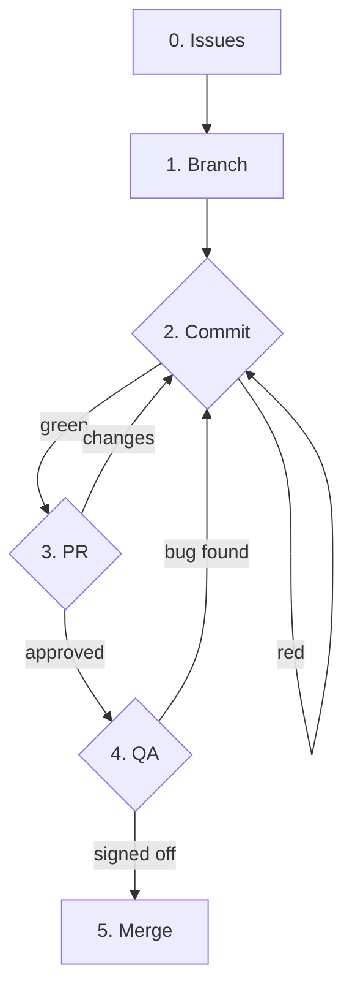

# Contributing to {{PROJECT_NAME}}

- **Laziness** — defer compute up the cost curve, each gate guarding a dearer one: tests → LLM review → human review.
- **Idiomatic platform use** — GitHub is your operational memory: issues hold intent, commits the work, PRs the decisions, Actions the verdict. Lean on its primitives instead of carrying that state yourself.

Role boundaries live in the [Working roles table](./AGENTS.md#working-roles). Read the row
for the role you are filling; it tells you which scoped guide matters for the work at hand.

## The loop



### 0. Issues

Link related issues & PRs. Description and diagnosis outranks fix proposal. Use the existing labels unless there is a real gap.

### 1. Branch

A branch scopes ≥1 issues under a title abstract enough to accommodate
implementation adjustments during review loop. Branch from the protected default.

**Plan the cluster first.** Before any code, name the selected issue or issue
cluster the branch will carry — that name is the PR's review/QA story. A *PR
represents one coherent human decision*, so cluster only issues a human can review
and QA as one: shared feature set, same review context, same QA path, or a strong
dependency. **Split** when issues diverge — unrelated behavior, a different QA
surface, high-risk changes, or a branch growing too large to inspect in one pass.

This branch-cluster is the **PR-cluster** axis, not the milestone axis: a milestone
groups issues by capability and spans many PRs; a PR cluster groups them by shared
QA surface. They're owned by different tiers — see the **Agent stack** in
[AGENTS.md](./AGENTS.md). Don't conflate them.

A few strategies for what to pick up: organize around blockers, defer hard design
decisions, take low-hanging fruit, or eat the frog.

### 2. Commit

Commits within a branch can be rough; the branch is a collaborative workspace.
It gets squashed/rebased on merge, so optimize for momentum and clean up the final
PR. Commit names should be a 1 liner with bullet points as necessary. They're the
branch's working memory, so make each a purposeful unit — the code change, then its tests.

A *commit represents one coherent unit of work*, so the default grain is
**one issue ≈ one purposeful commit**. Take multiple commits per issue freely when
the work naturally stages (code, then tests) or when review/QA feedback lands a
follow-up. Issues carry intent; commits carry implementation memory.

Each push runs the suite for the **areas it touched** via Actions
([`test.yml`](./.github/workflows/test.yml)) — a green **`ci`** is the gate out of step 2.
(Root/shared changes run every area; the squash merge re-runs the full diff.) Run focused
local checks for tight iteration:

| Change touches… | Run locally |
|-----------------|-------------|
| docs only | `git diff --check` |
| {{client}} | `{{npm test}}` |
| {{server}} | `{{cargo test}}` |

If a relevant check is skipped, say why in the PR body.

### 3. PR

Open the PR **as a draft** as soon as there's a first commit. Draft means work in
progress, not ready for review: it keeps work visible and runs CI continuously
through step 2. Reference every issue in the cluster (`Closes #42`). If major rework
starts after going ready, flip back to draft.

The PR is the unit of review and QA, so it should hold the cluster named in step 1
and nothing wider — *PRs carry the review/QA decision*. If a draft has drifted to mix
unrelated behavior or QA surfaces, split it before going ready.

Title it as a [Conventional Commit](https://www.conventionalcommits.org/) — it
becomes the squash-merge message:

```
<type>(<optional scope>): <imperative summary>

<optional body: what changed and why, not how>

<optional footer: Closes #42, BREAKING CHANGE: ...>
```

Types: `feat`, `fix`, `docs`, `refactor`, `test`, `chore`.

**Only once CI is green** flip **draft → ready for review** — the map's green edge.
Self-review the diff first, then fill out the PR body — GitHub prefills it from
[`PULL_REQUEST_TEMPLATE.md`](./.github/PULL_REQUEST_TEMPLATE.md): the title carries
what changed, the issue the why, green CI that it works — so the body holds only what
none of those do (decisions, open questions, known gaps).

Then work the review loop:

- If a reviewer is configured, wait for it. The reviewer reads the **whole diff**
  independently — the author's open questions add scrutiny, they don't scope it.
- Read every comment. Reply, or incorporate and push. When pushing a fix, reply with
  the **fixing commit SHA** and resolve the thread.
- Re-request review after substantive changes — each new commit warrants a fresh look.

Changes requested loops back to commit (step 2); approval advances to QA (step 4),
deploying beta (if the deploy ladder is enabled) for QA to run against.

### 4. QA

A human tests the actual functionality before merging — on the beta deploy, if it's
set up (approval ships it). A bug found loops back to commit (step 2); sign-off is the
go-ahead to merge.

### 5. Merge

Merge only when the **merge gate** is satisfied:

- [ ] Approved by a **non-author** reviewer on the **latest** commit
- [ ] No outstanding change-requests
- [ ] All required checks green
- [ ] Review threads resolved
- [ ] Branch is mergeable (no conflicts)

Prefer **squash merge** — each commit on the default branch is one logical change
with a clean "why" message, then delete the branch. Merge to the default branch
deploys prod (if the deploy ladder is enabled).
